# Core Concepts

APM implements the complete [AI-Native Development framework](https://danielmeppiel.github.io/awesome-ai-native/docs/concepts/) - a systematic approach to making AI coding assistants reliable, scalable, and team-friendly.

## Why This Matters

Most developers experience AI as inconsistent and unreliable:

- ❌ **Ad-hoc prompting** that produces different results each time
- ❌ **Context overload** that confuses AI agents and wastes tokens  
- ❌ **Vendor lock-in** to specific AI tools and platforms
- ❌ **No knowledge persistence** across sessions and team members

**APM solves this** by implementing the complete 3-layer AI-Native Development framework:

**🔧 Layer 1: Markdown Prompt Engineering** - Structured, repeatable AI instructions  
**⚙️ Layer 2: Context** - Configurable tools that deploy prompt + context engineering  
**🎯 Layer 3: Context Engineering** - Strategic LLM memory management for reliability

**Result**: Transform from supervising every AI interaction to architecting systems that delegate complete workflows to AI agents.

## AI-Native Development Maturity Journey

**From Manual Supervision → Engineered Architecture**

Most developers start by manually supervising every AI interaction. APM enables the transformation to AI-Native engineering:

### 🔴 Before APM: Manual Agent Supervision

The traditional approach requires constant developer attention:

- **Write one-off prompts** for each task  
- **Manually guide** every AI conversation step-by-step
- **Start from scratch** each time, no reusable patterns
- **Inconsistent results** - same prompt produces different outputs
- **Context chaos** - overwhelming AI with too much information
- **No team knowledge** - everyone reinvents their own AI workflows

*You're the bottleneck - every AI task needs your personal attention and guidance.*

### 🟢 With APM: Engineered Agent Delegation  

APM transforms AI from a supervised tool to an engineered system:

- **Build reusable Context** once, use everywhere
- **Engineer context strategically** for optimal AI performance
- **Delegate complete workflows** to AI with confidence
- **Reliable results** - structured prompts produce consistent outputs
- **Smart context loading** - AI gets exactly what it needs, when it needs it
- **Team knowledge scaling** - share effective AI patterns across the entire organization

*You're the architect - AI handles execution autonomously while following your engineered patterns.*

## The Infrastructure Layer

**APM provides the missing infrastructure for AI-Native Development**

### The Problem

Developers have powerful AI coding assistants but lack systematic approaches to make them reliable and scalable. Every team reinvents their AI workflows, can't share effective context, and struggles with inconsistent results.

### The Solution

APM provides the missing infrastructure layer that makes AI-Native Development portable and reliable.

Just as npm revolutionized JavaScript by creating package ecosystem infrastructure, APM creates the missing infrastructure for AI-Native Development:

- **Package Management**: Share and version AI workflows like code dependencies
- **Context Compilation**: Transform Context into dynamically injected context 
- **Runtime Management**: Install and configure AI tools automatically
- **Standards Compliance**: Generate agents.md files for universal compatibility

### Key Benefits

**🎯 Reliable Results** - Replace trial-and-error with proven AI-Native Development patterns  
**🔄 Universal Portability** - Works with any coding agent through the agents.md standard  
**📦 Knowledge Packaging** - Share AI workflows like code packages with versioning  
**🧠 Compound Intelligence** - Primitives improve through iterative team refinement  
**⚡ Team Scaling** - Transform any project for reliable AI-Native Development workflows

## Architecture Overview

APM implements a complete system architecture that bridges the gap between human intent and AI execution:

```mermaid
graph TD
    A["📝 Context<br/>.apm/ directory<br/>(.chatmode, .instructions, .prompt, .context)"] --> B["🔧 APM CLI"]
    
    B --> D["📦 APM Package Manager<br/>Dependencies<br/>Templates"]
    B --> C["⚙️ APM Context Compiler<br/>Script Resolution<br/>Primitive Compilation"]
    B --> E["🏗️ APM Runtime Manager<br/>Install & Configure<br/>Codex, LLM, etc."]
    
    C --> F["📄 AGENTS.md<br/>Portable Standard<br/>Cross-Runtime Compatible"]
    
    F --> G["⚡ AI Coding Agents<br/>Codex CLI, <br/>llm, ."]
    
    E --> H["🛠️ MCP Servers<br/>Tool Integration"]
    E --> I["🧠 LLM Models<br/>GitHub Models<br/>Ollama, etc."]
    
    style A fill:#e3f2fd,stroke:#1976d2,stroke-width:2px,color:#000
    style B fill:#f3e5f5,stroke:#7b1fa2,stroke-width:3px,color:#000
    style C fill:#f3e5f5,stroke:#7b1fa2,stroke-width:2px,color:#000
    style D fill:#f3e5f5,stroke:#7b1fa2,stroke-width:2px,color:#000
    style E fill:#f3e5f5,stroke:#7b1fa2,stroke-width:2px,color:#000
    style F fill:#fff3e0,stroke:#ff9800,stroke-width:2px,color:#000
    style G fill:#fce4ec,stroke:#c2185b,stroke-width:2px,color:#000
    style H fill:#e8f5e8,stroke:#388e3c,stroke-width:1px,color:#000
    style I fill:#fff3e0,stroke:#ff9800,stroke-width:1px,color:#000
```



**Key Architecture Components**:

1. **Context** (.apm/ directory) - Your source code for AI workflows
2. **APM CLI** - Three core engines working together:
   - **Package Manager** - Dependency resolution and distribution
   - **Primitives Compiler** - Transforms primitives → agents.md format  
   - **Runtime Manager** - Install and configure AI tools
3. **AGENTS.md** - Portable standard ensuring compatibility across all coding agents
4. **AI Coding Agents** - Execute your compiled workflows (Copilot, Cursor, etc.)
5. **Supporting Infrastructure** - MCP servers for tools, LLM models for execution

The compiled `agents.md` file ensures your Context work with any coding agent - from GitHub Copilot to Cursor, Codex to Aider.

## The Three Layers Explained

### Layer 1: Markdown Prompt Engineering

Transform ad-hoc prompts into structured, repeatable instructions using markdown format:

**❌ Traditional**: "Add authentication to the API"

**✅ Engineered**:
```markdown
# Secure Authentication Implementation

## Requirements Analysis
- Review existing security patterns
- Identify authentication method requirements
- Validate session management needs

## Implementation Steps
1. Set up JWT token system
2. Implement secure password hashing
3. Create session management
4. Add logout functionality

## Validation Gates
🚨 **STOP**: Security review required before deployment
```

### Layer 2: Context

Package your prompt engineering into reusable, configurable components:

- **Instructions** (.instructions.md) - Context and coding standards
- **Prompts** (.prompt.md) - Executable AI workflows  
- **Agents** (.agent.md) - AI assistant personalities
- **Skills** (SKILL.md) - Package meta-guides for AI agents
- **Context** (.context.md) - Project knowledge base

### Layer 3: Context Engineering

Strategic management of LLM memory and context for optimal performance:

- **Dynamic Loading** - Load relevant context based on current task
- **Smart Filtering** - Include only necessary information
- **Memory Management** - Optimize token usage across conversations
- **Performance Tuning** - Balance context richness with response speed

## Component Types

### Instructions (.instructions.md)
Context rules applied based on file patterns:

```yaml
---
applyTo: "**/*.py"
---
# Python Coding Standards
- Follow PEP 8 style guidelines
- Use type hints for all functions
- Include comprehensive docstrings
```

### Prompts (.prompt.md)  
Executable AI workflows with parameters:

```yaml
---
description: "Implement secure authentication"
mode: backend-dev
input: [auth_method, session_duration]
---
# Authentication Implementation
Use ${input:auth_method} with ${input:session_duration} sessions
```

### Agents (.agent.md)
AI assistant personalities with tool boundaries:

```yaml
---
name: "Backend Developer"
model: "gpt-4"
description: "Senior backend developer focused on API design"
tools: ["terminal", "file-manager"] 
---
You are a senior backend developer focused on API design and security.
```

### Skills (SKILL.md)
Package meta-guides that help AI agents understand what a package does:

```yaml
---
name: Brand Guidelines
description: Apply corporate brand standards
---
# How to Use
Apply these colors and typography standards...
```

Skills provide AI agents with a quick summary of package purpose and usage.

### Context (.context.md)
Optimized project knowledge for AI consumption:

```markdown
# Project Architecture

## Core Patterns
- Repository pattern for data access
- Clean architecture with domain separation
- Event-driven communication between services
```

## Universal Compatibility

APM generates context files for all major coding agents:

**VSCode/GitHub Target** (AGENTS.md + .github/):
- **GitHub Copilot** - VSCode integration, chat, and CLI
- **Cursor** - AI-first code editor  
- **Codex CLI** - OpenAI's development tool
- **Gemini** - Google's AI assistant

**Claude Target** (CLAUDE.md + .claude/):
- **Claude Code** - Anthropic's coding assistant
- **Claude Desktop** - Desktop application

APM auto-detects your target based on project structure (`.github/` or `.claude/` folders) and generates the appropriate format. This ensures your investment in primitives works regardless of which AI tools your team chooses.

## Learn the Complete Framework

APM implements concepts from the broader [AI-Native Development Guide](https://danielmeppiel.github.io/awesome-ai-native/) - explore the complete framework for advanced techniques in:

- **Prompt Engineering Patterns** - Advanced prompting techniques
- **Context Optimization** - Memory management strategies  
- **Team Scaling Methods** - Organizational AI adoption
- **Tool Integration** - Connecting AI with development workflows

Ready to see these concepts in action? Check out [Examples & Use Cases](examples.md) next!